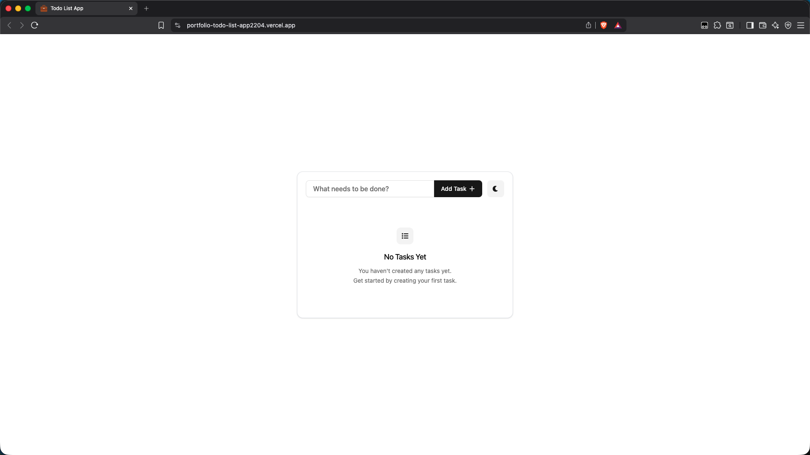
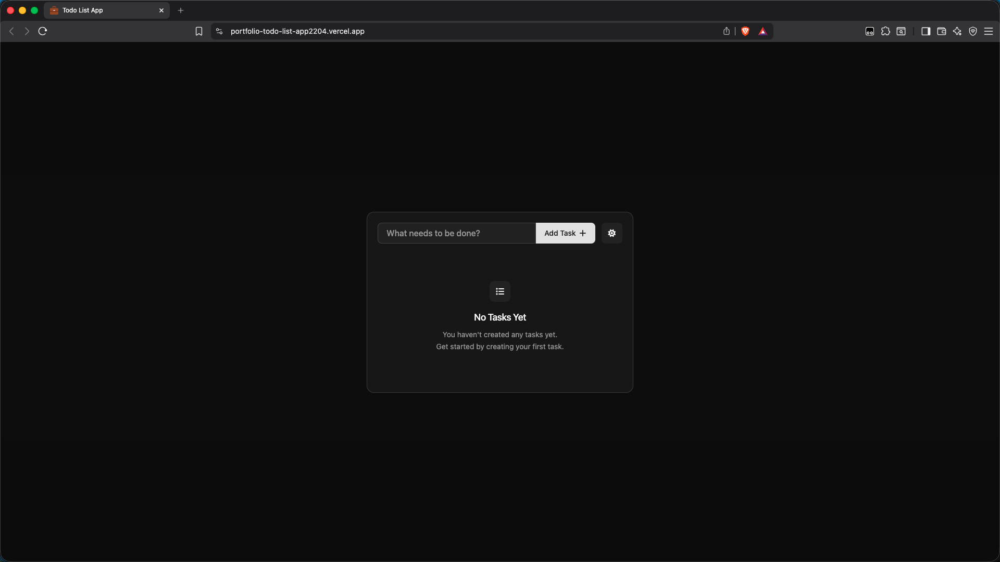

# __Todo List App__
A clean and minimal todo list application that provides full task management functionality, including creating, editing, deleting, and completing tasks.
The project is structured with modular components and reusable hooks, focuses on maintainability, and delivers a smooth and responsive user experience across all screen sizes.
The application persists tasks along with their state and user preferences, such as the selected theme, all stored in local storage to ensure data is preserved between sessions.

## __🚀 Live Preview__
[Click here to view the app online!](https://portfolio-todo-list-app2204.vercel.app/)

## __📸 Screenshots__
<div style="display: flex; gap: 12px;">
  
  
</div>

## __🧰 Tech Stack__
- Vite
- React
- TypeScript
- Tailwind CSS
- Shadcn/ui
- Font Awesome

## __💻 Local Installation__
```bash
git clone https://github.com/dominikw123/portfolio.todo-list-app.git
cd todo-list-app
npm install
npm run dev